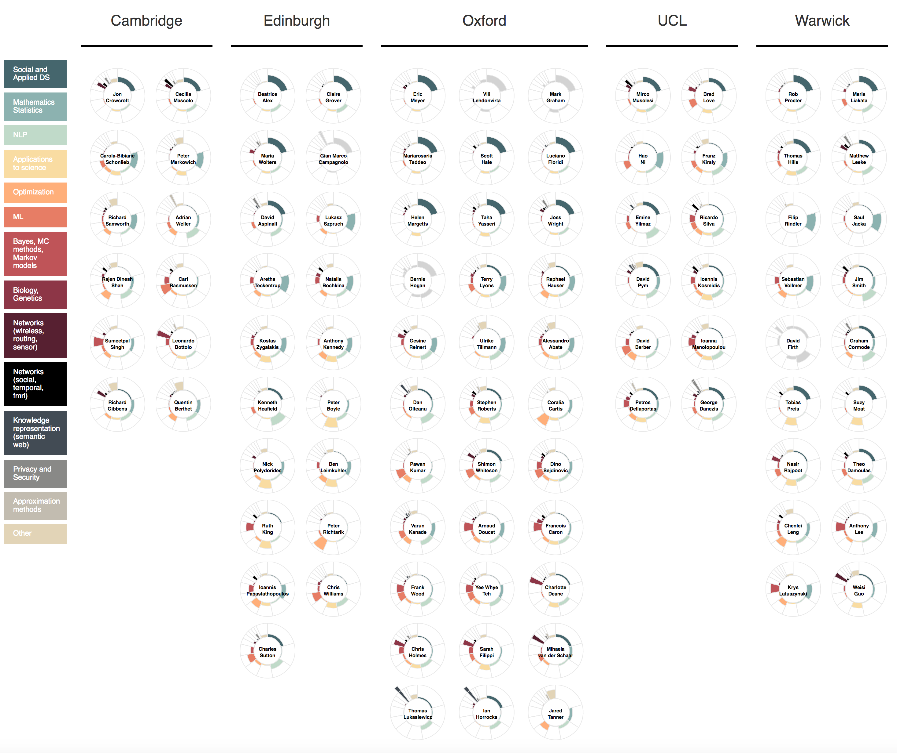

# Topic modeling (Latent Dirichlet Allocation) of Turing Institute publications

#### Aim:

Identify topics researched at the Alan Turing Institute

#### Overview:

For more details see the [blog post](topic_model_blog.md).

In summary, for each Turing fellow we downloaded up to 50 articles they published since 2012 (inclusive) using open access routes. The downloaded articles were converted to text files and cleaned. We analysed the text data using Latent Dirichlet Allocation (LDA) which identified 25 separate research topics in the dataset. The result is a visualisation of each Turing fellow and the extent to which their work falls under any of the identified research topics.  

#### Procedure:  

1: Identifying Turing fellows' publications  

We used Microsoft's [Academic Knowledge (AK) database](https://docs.microsoft.com/en-us/azure/cognitive-services/academic-knowledge/home) to extract publications records for each Turing fellow. We first [manually extracted](0_generate_AK_IDs.ipynb) a list of unique AK [IDs](data_files/turing_AK_IDs.csv) for all fellows to ensure we are targetting the right researchers in the database. We then used these IDs to retrieve a list of article titles, DOIs and source URLs.  

Method: [1_generate_publications_list.ipynb](1_generate_publications_list.ipynb)  
Results: [publications_eng.csv](data_files/publications_eng.csv)

2: Publications download

(i) A web scraper was built to download each of the articles identified in step 1 (relying on open access routes)   
Method: [2a_article_scraper.ipynb](2a_article_scraper.ipynb)

(ii) The downloaded PDFs were converted to .txt files (using Contentmine's [NORMA](https://github.com/ContentMine/norma) tool)  
see [2b_pdf_to_txt.md](2b_pdf_to_txt.md) for description

3: Data pre-processing  

All data was cleaned and combined into final analysis-ready csv file   
The final csv consists of 1 article per row and contains: fellow name, ID and affiliation, article title and ID, article full text and length, keywords scraped from the article files and AK provided keywords associated with the article.   
Method: [3_data_preprocessing.ipynb](3_data_preprocessing.ipynb)   
Data in 2 parts: [final_dataset_1.csv](data_files/final_dataset_1.csv) and [final_dataset_2.csv](data_files/final_dataset_2.csv)

4: Analysis

The converted texts were analysed using LDA (with [sklearn](http://scikit-learn.org/stable/modules/generated/sklearn.decomposition.LatentDirichletAllocation.html) in python)     
Method: [4_LDA.ipynb](4gi_LDA.ipynb)   
Results (topic proportions by researcher, used for visualisation purposes): [data_other.csv](visualisation/data_other.csv)   

5: Visualisation (see visualisation folder for details)

A visualisation of the final topics was built using D3.js and an adaptation of the [aster plot](http://bl.ocks.org/bbest/2de0e25d4840c68f2db1), relying on the results file generated in the previous step (see visualisation folder)   

