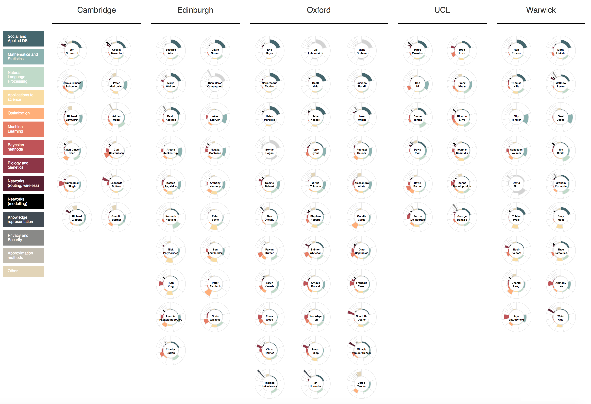

# Title

The Alan Turing Institute brings together researchers from a wide range of disciplines. While it is easy to find out what any individual researcher is working on, it is not as easy to find out and summarize how they all compare to each other, what they have in common and what differentiates one Turing fellow from another. As a data science team, we wanted to see whether we could develop a (mostly) automated method of answering this question by analysing the Turing fellows' publications (from the last 5 years) for research themes and topics using only open access tools.

The results are summarized in the below visualisation. The list of discovered research topics is ordered by topic size (i.e., the proportion of publications that were labeled as belonging to that topic). Each circle represents a Turing fellow and the segment widths also correspond to topic sizes. The coloured areas represent the proportion of each Turing fellow's work that, according to our algorithm, touches on each of the identified topics. While there is a lot of information packed into the single visualisation, it allows for drawing the kind of comparisons we were interested in. That is, identifying similarities and differences between individual researchers but also summarizing expertise across the entire institute.

  
*Note: Turing fellows represented in grey are those for whom we did not manage to download a sufficient number of articles.*

### What data?

Quite unsurprisingly, the greatest challenge in this project was not what we initially expected it to be and that was collecting sufficient publications data for all Turing fellows. More specifically, the challenge was finding a reliable, automated method (or requiring as little manual effort as possible) using tools and resources that are not behind a paywall but that are broad enough to target researchers from a wide range of research disciplines. Whenever I bring up this problem with physicists or mathematicians, for example, they always mention platforms such as arXiv but unfortunately it is not used by all research disciplines and equivalents don't as yet exist in all research fields. We run into similar and other problems with a whole range of what might otherwise seem as obvious approaches (for example, Google Scholar does not have an API).

Identifying who Turing fellows are is easy, they are all listed on the Turing website and a simple web-scrape can quickly generate a table of all Turing fellows as well as the University they are affiliated with. Despite a fair amount of effort, we did not manage to construct a generalized web-scraper that would also retrieve a list of publications for each fellow. Instead, we used Microsoft’s [Academic Knowledge (AK) API](https://docs.microsoft.com/en-us/azure/cognitive-services/academic-knowledge/home) which is a free service for searching academic publications. There was some manual work involved as we had to determine how each fellow was stored in the AK database. However, once we had a means of identifying each Turing fellow specifically (making sure we are not retrieving publications for other researchers, with the same name for example), writing a script that makes a request to the AK API for a list of publications for each Turing fellow was straightforward and fairly quick. This currently remains the best method we found of gathering this information (although I'd love to hear of alternatives!).

The AK database returns article title and in some instances also article abstract, article DOI and a list of source URLs (links to a range of content from only the article abstract to full text versions of the article). The returned source URLs provided a means of downloading at least a subset of the identified articles. Further, we used the article DOI (where available) to extract a further set of source links from the [oaDOI API](https://oadoi.org). A short script simply visited each of the identified URLs and if the retrieved content was a PDF, we downloaded it. In this way we collated a dataset of over 1800 articles.

### Identifying research topics

In terms of typical text data analysis projects, a collection of 1800 documents is not considered a large dataset. However, it is clear that even without requiring to read the entire article, manually searching through each of the downloaded texts for keywords, for example, would be extremely time consuming and inefficient. Topic modelling is a statistical approach to discovering a set of ‘topics’ in a collection of documents by analysing the words within the texts and their frequency of co-occurrence. It is quite remarkable that these models extract what is generally recognizable as 'topics' using a very simple idea of what language is and how it is used.

The most commonly used topic modelling method is Latent Dirichlet Allocation (LDA). LDA is a probabilistic generative model; it assumes a generative process that describes how documents are written given a collection of topics and then tries to reverse that process i.e., infer topics that could have generated a given set of documents. To understand the generative process, lets imagine we have 2 topics: the Czech Republic and Great Britain, and we want to write a document that is mostly about the Czech Republic but that also compares it to Britain. Further, we have 4 words in our vocabulary: British, Czech, weather, beer. For LDA, a topic is simply a probability distribution over our entire vocabulary. For example:   

|                  | British | Czech   | weather | beer    |
| ---------------- |:-------:| -------:| -------:| -------:|
| Topic **Britain**    |   .5    |   .0    |   .4    |   .1    |
| Topic **Czech Rep.** |   .0    |   .5    |   .2    |   .3    |

Similarly, a document is a probability distribution over all of our topics:

|   | Britain | Czech Rep. |
|---|:-------:|:----------:|
|Document| .2 | .8 |

According to LDA, if I want to write 10 words of the above defined document then for each word that I write:  
1. I randomly choose a topic (and I should choose Topic Czech Rep. 80% of the time)  
2. I randomly choose a word from that topic  

Following this two-step process for each word, I might generate something like:   

>Czech beer Czech beer Czech beer Czech weather British weather.

LDA tries to infer the original topics from a corpus of documents as well as the topic proportions for each document. As mentioned, the returned topics are simply distributions over the vocabulary. This means they require manual labelling for interpretation. In some sense it is misleading to talk about topics in this context and another term might be preferable. Especially as LDA as a model generalizes to other types of data (e.g., genetics, image processing, etc.) and has other uses than content analysis, such as dimensionality reduction (e.g. moving from vocabulary-length to topic-length vectors of features for each document, which in the case of this project is a reduction from some 63 000 to 25 features).

The topic labeling generally consists of looking at the top (usually most frequent or high probability) N words in each topic. The most frequent 5 words of a topic might be 'prior', 'distribution', 'posterior', 'sampling' and 'inference' and we would label that topic as 'Bayesian statistics’. However, many of the most frequent words in a topic are also the most frequent words in all texts and appear in many topics. In our case these were words such as 'model'. We therefore also looked at words that were not necessarily the most frequent but that were unique to a topic. Lastly, we also extracted the titles of articles that were assigned the highest proportion of a given topic. Especially the last step helped to interpret the returned topics as it provided context for the topic words (which were often less clearcut than is usually suggested in the examples you see in the literature). Using a combination of these approaches, we came up with the topic labels listed in the final visualisation.

### Comments

The original plan was to analyse only article abstracts but LDA did not seem to do well on what was quite a small collection of short texts so we decided to target full text articles. I know of a project that has successfully used only article abstracts with LDA but their data set was much larger (in terms of the number of documents) and their goals quite different to ours. In all fairness, it is not really surprising that a small collection of short texts might not be sufficient for the model to do well. It is also true that all the classic LDA examples come from large collections of articles and this might be the ideal setting for using LDA for text analysis, although I did not find much discussion of this in the literature. Overall, the LDA results were pretty impressive once we started using full articles.

Implementing LDA as a model (in Python or R for example) is well described in the literature and on various blogs with many ready-to-use implementations out there. The hardest aspect of using LDA was topic interpretation and labeling. The examples in the literature are much more well defined than some of our results. For some topics looking at frequent words was enough but it really made a large difference for this project once we also looked at titles of articles that were labeled as having the highest proportion of a given topic. This gave us context for the retrieved topic words. In the end we pooled quite a lot of information about the retrieved texts in addition to the returned topics to come up with labels that were interpretable and meaningful.

We collapsed the smallest topics into a single 'other' topic but even so we were left with 15 topics of the original modelled 25 to visualise for over a 120 Turing fellows. There are always going to be issues with trying to represent as much information as we tried to put into a single graphic. Some information inevitably always ended up being a little distorted. Nevertheless, while I did not expect to ever find myself opting for any variant of a pie chart as a means of displaying information, I do believe that in this case, surprisingly, it works pretty well. This was probably the most surprising part of the whole project.

All code can be found on [GitHub](https://github.com/alan-turing-institute/ati_tm)
